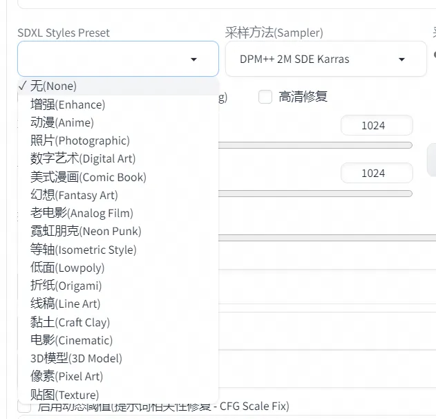

## SDXL官方的style预设

SDXL的style（不管是DreamStudio还是discord机器人）其实是通过提示词注入方式来实现的，官方自己在discord发出来了。  
这个A1111 webui插件，以插件形式实现了这个功能。  
实际上，例如StylePile插件以及A1111的style也能实现这样的功能。  
只是这个插件以一个极简的下拉菜单来完成。  

### 安装

将此仓库的地址复制到A1111 webui的扩展-从网址安装:  

https://github.com/daxijiu/sd-webui-sdxl-styles-preset.git  

点击安装，待提示安装完成后，切换到“已安装”页签，重启webui即可。  

### 使用

安装完成重启webui后，在“采样器”旁边就能看到选择预设的下拉菜单了。

### 感谢

这个仓库主要参考了https://github.com/ahgsql/StyleSelectorXL.git 的代码。  
SDXL Styles的文本来自于https://github.com/comfyanonymous/ComfyUI/discussions/934 中comfyanonymous的回答。

### License

这个项目使用MIT许可证，详见[LICENSE](LICENSE).
